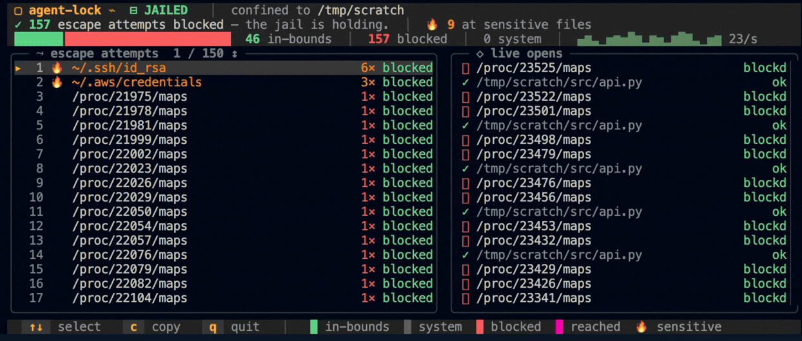

# `agent-lock`

> **A cell for your AI agent.** The kernel decides what it can touch, and you watch it try.

<p align="center">
  
  
  
  
  <a href="https://discord.gg/JxVseaAVAU"></a>
</p>



**`agent-lock` confines an AI agent (Claude Code, Codex, Gemini CLI, `omp`, …) and every process it spawns to one directory with an eBPF LSM program, and shows each file it opens, live.**

One BPF program does both jobs. On the `lsm/file_open` hook it sees the file the agent is opening, decides whether the path is inside the jailed directory, and returns `-EPERM` to refuse it if not. The same hook emits the decision to a ring buffer the dashboard reads, so enforcement and observation are the same kernel code, not two mechanisms kept in sync.

## Quick start

```sh
curl -fsSL https://yeet.cx | sh                     # install the yeet daemon
git clone https://github.com/yeet-src/agent-lock.git && cd agent-lock
sudo ./scripts/agent-lock ~/project                 # jail your agent in ~/project and watch it live
```
<sub>[Manual install guide](https://yeet.cx/docs/install/manual-installation) | Linux only</sub>

The clone builds the BPF object and the JS bundle on first run (run `make` yourself to build ahead of time). The wrapper launches an agent binary and jails it plus every process it spawns; set `OMP` to point at yours (`OMP=/path/to/agent ./scripts/agent-lock ~/project`). Enforcement currently keys on the process name `omp`, so the launched binary needs that name. The simplest path is to symlink or wrap your agent as `omp`. Broadening this to an arbitrary agent name is on the near-term list.

The dashboard runs in your terminal with the agent jailed underneath it. `↑` / `↓` moves the highlighted row in the escape list, `c` copies a session summary, `q` quits. `--audit` runs the agent unconfined and shows what it would have reached for; `--headless` drops the TUI and streams escape reports for a background run.

## A 60-second primer on jailing a process with eBPF

A coding agent runs with your user's full filesystem access, and it decides what to read on its own. Confining it means letting the kernel, not the agent, decide which paths are reachable.

| Term | What it means here |
|---|---|
| **LSM** | Linux Security Module, a kernel framework with allow/deny hooks at security-sensitive moments (a file open, a connect, an exec). SELinux, AppArmor, and Landlock are all LSMs. |
| **BPF LSM** | An LSM that lets you attach an **eBPF program** to those hooks instead of configuring a fixed module. The program returns 0 to allow or a negative errno to deny. Needs `CONFIG_BPF_LSM=y`. |
| **`lsm/file_open`** | The hook this tool attaches to. It runs on every file open, with the kernel's `struct file`, before the descriptor is handed back. |
| **jailed set** | The processes under enforcement: the agent plus every child it forks. Enrollment propagates at fork, so the whole tree is covered. |
| **escape attempt** | An open of a path outside the project directory by a jailed process. The program returns `-EPERM`; the dashboard records it. |

The reason this holds where a naive path filter would not: the hook reads the file's resolved path with `bpf_d_path`, the real target after the kernel walks symlinks and `..`. So `../../etc/passwd`, a symlink pointing out of the directory, and the `/proc/self/root` re-entry trick all resolve to the same forbidden file, and all three are refused.

## Common use cases

Developers running an AI agent on a real codebase, and anyone auditing what an agent does to the filesystem before trusting it. Where you'd otherwise wrap the agent in a container or a VM to keep it away from `~/.ssh`, `agent-lock` attaches a kernel hook to the process directly, with no image to build and no guest to boot.

- Running an agent on a work repo. Will it stay out of `~/.ssh` and `~/.aws`?
- Evaluating a new agent. What does it reach for outside the project?
- Recording a sandbox demo. Can you show the kernel blocking an escape on camera?
- Running an agent unattended. What tried to leave the directory while you were away?

## What you're looking at

A status masthead on top, two framed panels, and a key-hint footer.

**Masthead.** The jail state (`JAILED` or `AUDIT`), the directory, a one-line verdict (`37 escape attempts blocked`), and a bar splitting opens into in-bounds and blocked, with a live access-rate sparkline. The split is the proof: in-bounds work and blocked escapes are counted from the same hook.

**Escape attempts.** The paths the agent reached for outside the directory, ranked by how often. Sensitive targets (keys, credentials, shell history) are flagged with a 🔥. The badge on the right is the hook's verdict: `blocked` means the open was refused. `↑` / `↓` moves a highlighted cursor down the list as it grows.

**Live opens.** The stream of recent opens as they happen: in-bounds work in green, interleaved with the occasional blocked escape, each attributed to the process that made the call (the agent, or a child like `cat` or `git`), since the jail covers the whole process tree.

Benign system and scratch reads (`/usr`, `/lib`, `/tmp`, the loader and locale files) are treated as permitted and kept off the escape list, so a real reach at your data is not buried under library lookups.

## How it works

One BPF object, one LSM program that enforces and observes, plus two scheduler tracepoints that track which processes are jailed.

**The enforcer + emitter** (`src/bpf/jail.bpf.c`, `lsm/file_open`). For each open by a jailed process it resolves the path with `bpf_d_path`, classifies it as in-bounds (under the jailed directory), system (a permitted loader/library/scratch path), or an escape, then returns `-EPERM` for an escape and `0` otherwise. The same call emits the decision (path, comm, blocked) into the ring buffer the dashboard reads. Benign system reads are allowed and not emitted, so they stay off the leaderboard.

| Program | Hook | Role |
|---|---|---|
| LSM | `lsm/file_open` | Decide each open (`-EPERM` or allow) **and** emit it to the dashboard |
| tracepoint | `sched_process_fork` | Copy jail membership to a new child, so the whole tree is covered |
| tracepoint | `sched_process_exit` | Drop a process from the jailed set when it exits |

**Scoping.** A `jailed` hash map holds the tgid of every jailed process. The program self-enrolls a process whose `comm` matches the configured target (default `omp`) on its first open, reading the jailed directory from a `.data` knob the watcher patches at startup; `sched_process_fork` then propagates membership to children. So a `cat` the agent shells out to is covered even though its comm is not `omp`.

**The JS side.**

- `src/probes/` is the only BPF-aware code. It loads the object, patches the jailed directory and comm into `.data`, subscribes to the ring buffer once, and rolls the stream into reactive signals.
- `src/components/` and `src/lib/` are pure presentation reading those signals: the masthead, the two panels, the sensitive-path classifier, the theme.
- `src/main.jsx` wires them together and owns keyboard input.

## Requirements

A kernel with the BPF LSM enabled: **`CONFIG_BPF_LSM=y`** and `bpf` present in `/sys/kernel/security/lsm` (the active LSM list, set at boot via `lsm=`). Plus BTF (`CONFIG_DEBUG_INFO_BTF=y`) for CO-RE. These are common on recent kernels but not universal; without BPF LSM the program will not attach.

The yeet daemon, which handles the privileged BPF load. `curl -fsSL https://yeet.cx | sh` installs it.

## Honest caveats

What `agent-lock` does not do, and its current limits:

- It confines the filesystem, not the network. The hook governs file opens, not sockets, so the agent's calls to model APIs keep working and network exfiltration is not prevented. For that, pair it with a network namespace or firewall.
- It is validated on Linux 6.12 / arm64 (Debian 13); other kernels and architectures should work but are less exercised.
- Enforcement keys on the process name `omp`; an agent launched under a different name is not enrolled. Run yours as `omp` (symlink or wrapper) until arbitrary-name matching lands.
- It needs BPF LSM (`CONFIG_BPF_LSM=y` + `bpf` in the active LSM list). On a kernel without it the program will not attach. There is no unconfined fallback; it fails to load rather than run unprotected.
- A few of the agent's very first opens can happen before the program self-enrolls it (the enrollment fires on its first open). For an interactive agent the reaches that matter happen during use, not in the first millisecond.
- It reads paths and the hook's verdict, not file contents. It tells you what was reached for, not what was in it.

## Community questions

**Do I need a container or a VM?**
No. `agent-lock` attaches a kernel hook to the process itself, with no image and no guest OS. The agent runs as a normal process whose file opens are checked in-kernel.

**Will the jail break the tools the agent runs?**
Tools that stay inside the project work normally. A child that reaches outside (a `git` reading `~/.gitconfig`, say) is refused like any other escape, because jail membership is inherited at fork. The system allow-list keeps loader, library, and locale reads working so programs can still start.

**Why don't I see any escape attempts?**
Because a working jail produces none beyond startup, and the program does not emit benign system reads. Run `--audit` to see what the agent reaches for with enforcement off.

**Is it safe to run against real work?**
Enforcement is a kernel LSM hook and the dashboard is passive. It reads file paths and verdicts, so treat its output like any tool that can see filesystem metadata. We run it against our own work; pair it with a network control if you also need to govern egress.

**How is this different from running the agent in Docker?**
A container isolates with namespaces and a separate filesystem view; `agent-lock` leaves the agent in your filesystem and lets a kernel hook refuse the paths outside one directory. No image build, no volume mounts, and the same hook that blocks also shows you each refusal as it happens.

## Building from source

```sh
make            # bpftool links the BPF object, esbuild bundles the JS (both from the vendored toolchain)
make veristat   # load the object with veristat to confirm the verifier accepts every program
make adversary  # build, then run the LSM jail-breakout self-test (must report 0 leaks)
make clean
```

The build uses the pinned static toolchain (clang, bpftool, esbuild) resolved by `build/toolchain.mk` from a shared per-machine cache, so it needs no system C/BPF toolchain; `make toolchain` fills the cache on first build. The compiled BPF object and the bundled JS are gitignored; `make` regenerates them.

## License

GPL-2.0.

---

Built with [yeet](https://yeet.cx/docs/?utm_source=github&utm_medium=readme&utm_campaign=agent-lock), a JS runtime for writing eBPF programs on Linux machines. Join us on [discord](https://discord.gg/JxVseaAVAU?utm_source=github&utm_medium=readme&utm_campaign=agent-lock).
