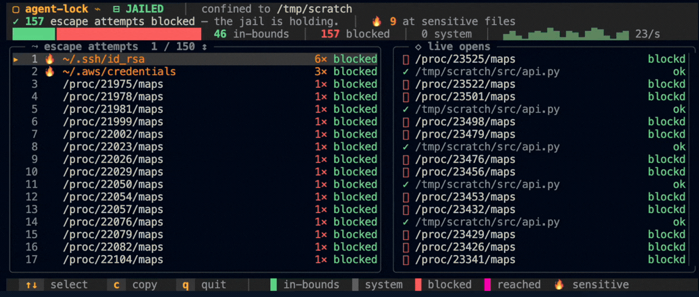

<!-- yeet:user-friendly-title: Enforce agentic policies -->

# `agent-lock`

> **A cell for your coding agent.** The kernel decides what it can touch, and you watch it try.

<p align="center">
  <a href="#requirements"></a>
  <a href="https://yeet.cx/docs/?utm_source=github&utm_medium=readme&utm_campaign=agent-lock&utm_content=badge"></a>
  <a href="#the-bpf-side"></a>
  <a href="#how-it-works"></a>
  <a href="LICENSE"></a>
  <a href="https://discord.gg/JxVseaAVAU"></a>
</p>

<p align="center">
  
</p>

**`agent-lock` is an eBPF filesystem jail for Linux: it confines a coding agent and every process it spawns to one directory, and shows each file it tries to open outside it.**

One BPF program does both jobs. On the `lsm/file_open` hook it sees the file the agent is opening, decides whether the resolved path is inside the jailed directory, and returns `-EPERM` to refuse it if not. The same hook emits the decision to a ring buffer the dashboard reads, so enforcement and observation are the same kernel code rather than two mechanisms kept in sync.

The thing you would otherwise reach for is a container, a VM, or a hand-written seccomp filter. A container means building an image, mounting volumes back in, and reasoning about what you re-exposed; seccomp filters syscall numbers and arguments, so it cannot express "this path, but not that one" once symlinks are in play. `agent-lock` leaves the agent as a normal process in your own filesystem and lets a kernel hook refuse the paths outside one directory, with no image to build and no guest to boot.

> [!TIP]
> **The path it checks is the one the kernel resolved, not the one the agent typed.** `bpf_d_path` hands the hook the real target after symlinks and `..` are walked, so `../../../etc/passwd`, a symlink planted inside the jail, and the `/proc/self/root` re-entry trick all resolve to the same forbidden file and all three are refused.

## Questions this tool answers

**I want to hand coding agents to my team without giving each one read access to every developer's `~/.ssh` and `~/.aws`. What's the smallest thing that works?**
Wrap the agent launch in `agent-lock <project-dir>`. The jail is a BPF LSM program plus a directory argument, so the blast radius of an agent becomes one path instead of a whole home directory. There is no image to build, nothing to mount back in, and no per-developer policy file to distribute. See [Quick start](#quick-start).

**Can I confine an agent without putting it in a container or a VM?**
Yes, and that is the shape of the tool. The agent stays a normal process on your filesystem; a `lsm/file_open` program checks each open in-kernel and returns `-EPERM` for anything outside the jailed directory. Nothing is virtualized, so the agent still sees your real repo with your real toolchain, and startup cost is a BPF load rather than a boot. See [Why an LSM hook, not a container or seccomp](#why-an-lsm-hook-not-a-container-or-seccomp).

**Before I enforce anything, I want to know what an agent actually reaches for. Can I watch first?**
Run `--audit`. The same program classifies and reports every decision but never returns `-EPERM`, so you get the full list of what would have been blocked with the jail effectively off. That's the honest way to size a policy before turning it on, and it's also how you check whether a directory boundary you're considering would break the agent's own toolchain.

**Does it cover the tools the agent shells out to, or just the agent process?**
The whole tree. Membership lives in a `jailed` hash map keyed by tgid, and a `sched_process_fork` tracepoint copies it to every child, so a `git`, `cat`, `node` or `grep` the agent spawns is confined too even though its process name differs. This matters more than it sounds: most of an agent's file opens come from children, not from the agent binary itself.

**Does this work with Claude Code, Codex, oh-my-pi, or a DeepSeek-based agent?**
Any of them. Nothing in the jail knows what an agent is or who makes it: it confines a **process tree**, matched by process name, so whatever binary you launch is what gets confined. The name is a runtime knob (`target_comm`, patched into `.data` at startup), not a compiled-in assumption.

The one thing to know is that the shipped wrapper passes `--comm omp` rather than deriving the name from the binary you gave it, so today you launch your agent under the name `omp` (a symlink or a two-line wrapper) and point `OMP` at it. See [Launching a differently-named agent](#launching-a-differently-named-agent).

**I want to leave this running unattended and collect what tried to escape. Is there a non-interactive mode?**
`--headless` drops the TUI and writes one structured JSON record per escape attempt to stdout, de-duplicated per path with a periodic rollup so a tight loop on one secret doesn't flood the log. Pipe it to a file or a log shipper. See [Reading it without a TTY](#reading-it-without-a-tty).

**Is this a replacement for a container sandbox, gVisor, or a full VM?**
No, and it is deliberately narrower. `agent-lock` governs **file opens on one host, for one process tree, against one directory**. It does not isolate the network, PIDs, or devices; it has no image, no snapshot, and nothing to roll back. A container or microVM gives you a whole isolated world and is the right answer when the code you're running is genuinely untrusted. `agent-lock` is for the common case where you trust the agent's intent but not its judgment about which files are its business, and you want it working in your real tree.

**When should I use this instead of Landlock, seccomp, or AppArmor?**
Reach for `agent-lock` when you want a directory boundary plus a live view of what hit it, on a kernel that has BPF LSM. Reach for **Landlock** when you want unprivileged, per-process confinement with no BPF and no root, and you don't need the observability half; its predecessor [`agent-jail`](https://github.com/yeet-src/agent-jail) took that route and enforces on the resolved inode rather than the path, which closes the hardlink gap noted below. Reach for **AppArmor or SELinux** when you need a persistent, system-wide policy that survives reboots and is managed by your distro rather than started per-run. Reach for **seccomp** when the thing you want to restrict is which syscalls exist at all, not which paths they may touch.

## Contents

**Run it** — [Quick start](#quick-start) · [Have an agent set it up](#have-an-agent-set-it-up) · [Without a TTY](#reading-it-without-a-tty) · [Demo](#try-it-without-a-real-agent)

**Understand it** — [Questions this tool answers](#questions-this-tool-answers) · [A 60-second primer](#a-60-second-primer-on-jailing-a-process-with-ebpf) · [What you're looking at](#what-youre-looking-at) · [How it works](#how-it-works) · [What it can't see](#what-it-cant-see)

**Reference** — [Navigation](#navigation) · [Requirements](#requirements) · [FAQ](#faq) · [License](#license)

**Contribute** — [Building from source](#building-from-source) · [Testing across kernels](#testing-across-kernels) · [The breakout self-test](#the-breakout-self-test)

## Quick start

```sh
curl -fsSL https://yeet.cx | sh                      # install the yeet daemon, once
git clone https://github.com/yeet-src/agent-lock && cd agent-lock
make                                                 # bin/probe.bpf.o + the JS bundle
sudo ./scripts/agent-lock ~/project                  # jail your agent in ~/project, watch it live
```
[Manual install guide](https://yeet.cx/docs/install/manual-installation?utm_source=github&utm_medium=readme&utm_campaign=agent-lock) | Linux only

With no flags, `scripts/agent-lock <dir>` loads the BPF program, patches `<dir>` in as the jail boundary, launches your agent, and renders the dashboard with the agent confined underneath it. The directory argument is canonicalized before it reaches the kernel, because the check is a byte-prefix compare against the resolved path. Omit the directory and it jails the current working directory.

The wrapper is a shell script rather than `yeet run` directly, because it has to sequence three things: load and attach the program, patch the boundary into `.data`, then start the agent, in that order, so the agent is jailed from its first open.

| flag | default | meaning |
| --- | --- | --- |
| `--audit` | off | run the agent **unconfined** and report what would have been blocked. The hook still classifies and emits every decision, but never returns `-EPERM`. Use this to size a boundary before enforcing it |
| `--headless` | off | no TUI. Stream one JSON record per escape attempt to stdout, de-duped per path with a rollup every 5s. For unattended runs |
| `OMP=<path>` | `omp` on `PATH` | which agent binary to launch. The wrapper matches on the name `omp`, so launch yours under that name; see [below](#launching-a-differently-named-agent) |

```sh
sudo ./scripts/agent-lock ~/project                          # jail, with the dashboard
sudo ./scripts/agent-lock --audit ~/project                  # watch what it reaches for, block nothing
sudo ./scripts/agent-lock --headless ~/project > escapes.log # unattended, JSON per escape
OMP=/usr/local/bin/my-agent sudo -E ./scripts/agent-lock ~/project
sudo ./scripts/agent-lock ~/project -- --model sonnet         # everything after -- goes to the agent
```

Arguments after `--` are passed through to the agent rather than consumed by the wrapper. The dashboard runs until `q` and reflows on resize, so it needs a real terminal; use `--headless` if you're piping or redirecting.

### Launching a differently-named agent

The kernel side takes any process name. `configure(dir, comm, audit)` patches whatever you give it into `target_comm`, and `src/main.jsx` already accepts a `--comm` flag. What pins things today is one line of the shell wrapper, which passes a literal `--comm omp` instead of the basename of the binary it launches.

Until that is derived automatically, give your agent the expected name:

```sh
ln -sf "$(command -v claude)" ~/.local/bin/omp        # or codex, or your own agent
OMP=~/.local/bin/omp sudo -E ./scripts/agent-lock ~/project
```

`sudo -E` matters: plain `sudo` drops `OMP` from the environment and you silently get the default.

Driving the script directly instead of through the wrapper, the name is just an argument. The daemon handles the privileged load, so this takes no `sudo`. `--dir` must be absolute, since the kernel compares it as a byte prefix against resolved paths:

```sh
yeet run . -- --dir ~/project --comm claude --mode jail
```

Whichever route you take, confirm the name matched: an agent whose name was never enrolled runs **unconfined**, and an empty dashboard looks the same either way. `--audit` showing nothing means nothing is enrolled.

## Have an agent set it up

Paste this into Claude Code or any agent with shell access:

```
Clone https://github.com/yeet-src/agent-lock and work in it.
Read AGENTS.md first, then:

1. Install yeet if it isn't present: curl -fsSL https://yeet.cx | sh
2. Check this kernel can enforce at all, before building anything:
     grep -q BPF_LSM=y /boot/config-$(uname -r) 2>/dev/null || zgrep -q BPF_LSM=y /proc/config.gz
     cat /sys/kernel/security/lsm    # must contain "bpf"
   If "bpf" is absent from that list, STOP and report it: the program cannot
   attach, and no amount of building will change that. It is set at boot via
   the lsm= kernel parameter, not at runtime.
3. Run `make` and confirm bin/probe.bpf.o was produced.
4. Prove the jail actually holds, which is not the same as "it built":
     sudo make adversary
   Expect 0 leaks and exit 0. One line reports a [known] hardlink
   limitation; that is expected and is not counted as a leak.
5. Run the demo so there is something on screen without a real agent:
     sudo ./scripts/demo.sh
   Confirm the escape leaderboard fills with blocked reaches at ~/.ssh and
   ~/.aws, then press q.

"It compiled" is not the same as "it works", and for a containment tool that
gap is the whole point: report step 4's leak count, not just that make exited 0.
```

Prefer to drive it yourself? [Quick start](#quick-start) is the same path in four commands.

## A 60-second primer on jailing a process with eBPF

A coding agent runs with your user's full filesystem access, and it decides what to read on its own. Confining it means letting the kernel, not the agent, decide which paths are reachable.

| Term | What it means here |
|---|---|
| **LSM** | Linux Security Module, a kernel framework with allow/deny hooks at security-sensitive moments (a file open, a connect, an exec). SELinux, AppArmor and Landlock are all LSMs. |
| **BPF LSM** | An LSM that lets you attach an **eBPF program** to those hooks instead of configuring a fixed module. The program returns 0 to allow or a negative errno to deny. Needs `CONFIG_BPF_LSM=y`. |
| **`lsm/file_open`** | The hook this tool attaches to. It runs on every file open, with the kernel's `struct file`, before the descriptor is handed back. |
| **jailed set** | The processes under enforcement: the agent plus every child it forks. Enrollment propagates at fork, so the whole tree is covered. |
| **escape attempt** | An open of a path outside the project directory by a jailed process. The program returns `-EPERM`; the dashboard records it. |

The reason this holds where a naive path filter would not is that the hook reads the file's resolved path with `bpf_d_path`, the real target after the kernel walks symlinks and `..`. It is also the reason for the one gap the jail does not close: a **hardlink** planted inside the jail is a real directory entry under the jailed directory, so the resolved path is genuinely in bounds and the read is allowed. Path-based enforcement cannot see through that; closing it needs inode-level checks. That limit is stated again in [What it can't see](#what-it-cant-see) and is exercised explicitly by the [breakout self-test](#the-breakout-self-test).

## What you're looking at

```
 ▢ agent-lock ⌁  ⊟ jailed  │ confined to ~/webapp
 ✓ 37 escape attempts blocked — the jail is holding.  │ 🔥 11 at sensitive files
 in-bounds ████████████████████████░░░░░░ blocked   ▁▂▅▇▅▂▁▂▄▇▆▃▁▂

┌─ ⤳ escape attempts  3 / 12 ↕ ──────────────┐┌─ ◇ live opens ──────────────────┐
│ 🔥 ~/.ssh/id_rsa                 9  blockd ││ →  src/api/router.ts        ok  │
│ 🔥 ~/.aws/credentials            6  blockd ││ ⤳  ~/.ssh/id_rsa        blockd  │
│ 🔥 /etc/passwd                   5  blockd ││ →  package.json             ok  │
│    ~/.gitconfig                  4  blockd ││ →  src/lib/db.ts            ok  │
│ 🔥 ~/.config/gh/hosts.yml        3  blockd ││ ⤳  ~/.gitconfig         blockd  │
│    ~/.npmrc                      2  blockd ││ →  tests/format.test.ts     ok  │
└────────────────────────────────────────────┘└─────────────────────────────────┘
  ↑↓ select   c copy   q quit  │  █ in-bounds  █ system  █ blocked  █ reached
```

A status masthead on top, two framed panels side by side (they stack on a narrow terminal), and a key-hint footer.

**Masthead.** The jail state (`jailed`, or a highlighted `audit · unconfined`), the directory, a one-line verdict, and a bar splitting opens into in-bounds and blocked with a live access-rate sparkline. The split is the proof: legitimate work and refused escapes are counted by the same hook, in the same pass.

**Escape attempts.** Paths the agent reached for outside the directory, ranked by how often. `↑` / `↓` moves a highlighted cursor and the title shows its position (`3 / 12`), so the list stays navigable as it grows past the pane.

**Live opens.** Recent opens as they happen, newest first, each attributed to the process that made the call. Since the jail covers the whole tree, this is where you see `git`, `cat` or `node` appear rather than only the agent binary.

| Column | Meaning |
|---|---|
| 🔥 | the path matched a known high-value target: SSH and cloud keys, `.env`, `.netrc`, shell history, `/etc/shadow`. Cosmetic ranking only, not a separate rule; the jail already refused it |
| path | the resolved path, with `$HOME` collapsed to `~` and long paths clipped from the left so the filename stays visible |
| count | how many times this exact path was reached for. A tight retry loop is one row with a rising count, not many rows |
| `blockd` | the hook returned `-EPERM`. Under a working jail this is every escape row |
| `reachd` | an out-of-bounds open that **succeeded**. Only possible with `--audit`; on the escape list under enforcement this should be zero |
| `ok` | an in-bounds open, allowed |

Benign system and scratch reads (`/usr`, `/lib`, `/tmp`, the loader and locale files) are classified as permitted in the kernel and never emitted at all, so a real reach at your data is not buried under library lookups.

The word is **reached**, not leaked, and the distinction is deliberate: the open succeeded, but a successful `open` on a directory or a handle proves nothing was read out. Overstating that on a containment tool would make every other number less believable.

## Navigation

| key | action |
|---|---|
| `↑` / `↓`, `k` / `j` | move the highlighted row in the escape list |
| `PgUp` / `PgDn` | move by a screenful, tracking the live pane height |
| `g` / `G` | jump to the top or the bottom of the list |
| `c` | copy a session summary to the clipboard over OSC 52, and echo it |
| `q`, `Esc` | quit the dashboard, then stop the agent it launched |

The panels update in place at a 400ms cadence; the selection stays put while the list grows underneath it.

## Reading it without a TTY

`--headless` is the non-interactive path, and it is a first-class mode rather than a degraded one:

```sh
sudo ./scripts/agent-lock --headless ~/project > escapes.log
```

It never touches `tty.*` (which throws without a PTY), writing one JSON record per escape attempt to stdout instead:

```json
{"event":"escape_attempt","path":"/home/u/.ssh/id_rsa","by":"cat","outcome":"blocked","sensitive":true,"dir":"/home/u/project","mode":"jail"}
```

`outcome` is `blocked` or `reached`, taken from the kernel's own verdict rather than re-derived in JS. Records are de-duplicated per path with a rollup every 5 seconds, so an agent retrying one secret in a loop produces one record and a count rather than thousands of lines. In-bounds and permitted-system opens are not reported; the headless stream is only the escapes.

What an agent or a CI job should run to verify the tool genuinely works is `sudo make adversary`, which exits non-zero if anything leaked. See [the breakout self-test](#the-breakout-self-test).

There is no `--json` one-shot mode and no probe self-test entry point: `src/probes/probe.js` loads the object but has no `import.meta.main` block, so the headless wrapper is the only text path. If you want a fixed-duration probe that attaches, aggregates and exits, that module is where it belongs.

## How it works

`src/probes/` is the only BPF-aware code, `src/components/` is pure presentation, `src/lib/` is pure helpers, and `@/` resolves to `src/` at bundle time.

```
src/bpf/jail.bpf.c        the whole kernel side: enforce + emit, plus fork/exit tracking
src/bpf/include/jail.h    shared struct + width constants (PREFIX_MAX, JPATH_MAX)
src/probes/probe.js       loads bin/probe.bpf.o, binds the maps, starts (auto-attaches)
src/probes/fileaccess.js  patches .data, subscribes to the ring buffer, exposes signals
src/lib/classify.js       sensitive-target matching; mirrors the kernel's allow-lists
src/lib/report.js         the headless JSON/text reporter
src/lib/summary.js        the clipboard session summary
src/components/*.jsx      masthead, escape leaderboard, live feed, footer
src/main.jsx              layout, keyboard input, wiring
```

### The BPF side

| program | hook | what it does |
|---|---|---|
| `on_file_open` | `lsm/file_open` | resolve the path, classify it, return `-EPERM` for an escape, **and** emit the decision |
| `on_fork` | `tracepoint/sched/sched_process_fork` | copy jail membership from parent to child, so the tree is covered |
| `on_exit` | `tracepoint/sched/sched_process_exit` | drop a process from the jailed set when it exits |

| map | type | holds |
|---|---|---|
| `events` | `RINGBUF` (256 KB) | one `file_event` per non-system decision: path, comm, in_bounds, blocked |
| `jailed` | `HASH` (8192) | tgid → `jail_cfg` for the agent and every descendant |
| `cfg_scratch` | `PERCPU_ARRAY` | scratch for building a `jail_cfg` at enrollment time |

Three knobs live in `.data` and are patched from JS at startup: `target_prefix` (the jailed directory), `target_prefix_len`, and `target_comm`, plus `audit_mode` for `--audit`. They are initialized to non-zero values so the compiler keeps them in `.data` rather than moving them to `.bss`, where `DataSec.patch` could not reach them.

The classification is three-way, and the middle case is what makes the tool usable: a path under the jailed directory is allowed, a path under a system or scratch prefix (`/usr/`, `/lib/`, `/proc/`, `/tmp/`, plus exact matches for `/etc/ld.so.cache`, `/etc/resolv.conf` and friends) is allowed **and not emitted**, and anything else is refused. Without that allow-list a jailed program cannot load libc, and every `exec` would flood the leaderboard with loader noise.

Two details in that allow-list are load-bearing rather than incidental. Prefix matching requires a **component boundary**: a jail at `~/project` must not also permit `~/project2`, so a prefix that does not itself end in `/` only matches when the next byte is `/` or `\0`. And `/proc/` is broadly allowed for the runtime, but a read of another task's `environ`, `mem`, `maps` or `cmdline` is reclassified as an escape, because those are reaches at another process's secrets rather than benign runtime introspection.

<details>
<summary>Three things the verifier and the compiler made harder than they look</summary>

**The path must land on the stack.** `bpf_d_path` into a stack buffer is what actually enforces; resolving into a map-value pointer did not, which is why `JPATH_MAX` is sized to fit a stack allocation rather than being generous.

**The verdict needs a barrier.** Returning `escape ? -EPERM : 0` directly let clang fuse the comparisons into the return as `-(bits)`, which is unsigned and outside the `[-4095, 0]` range the LSM verifier demands. An `asm volatile("" : "+r"(escape))` forces a clean select between two known constants.

**The `.data` prefix has to be copied byte by byte.** A bulk `__builtin_memcpy` from the casted volatile array let the compiler collapse the `.data` section to size 0, at which point there is nothing for `DataSec.patch` to write into. The indexed loop keeps the section real.

Enrollment is written to avoid a race rather than to be clever: a process whose comm matches self-enrolls into `jailed` on its **first open**, inside the same hook that is about to decide that open. There is no window between "we noticed it" and "we are enforcing on it", and because the root is in the map before it forks, `sched_process_fork` covers everything downstream.

</details>

### The JS side

| module | responsibility |
|---|---|
| `probes/probe.js` | one `BpfObject`, three `bind`s, one `start()`; all programs auto-attach |
| `probes/fileaccess.js` | `configure()` patches `.data`; a `from()` signal folds the ring buffer into counters, the ranked escape list, the feed and the sparkline on a 400ms window |
| `lib/classify.js` | the 🔥 sensitive-target list, mirroring the kernel's allow-lists so the two agree |
| `lib/report.js` | headless records, de-duped per path with a rollup |
| `components/*` | read signals, render; no BPF awareness |

Userspace deliberately does **not** re-decide anything. The hook already made the access-control decision in kernel space, so `in_bounds`, `system` and `blocked` are trusted as they arrive; JS only adds the sensitive-target flag, which is cosmetic ranking the kernel has no reason to compute. Keeping the decision in one place is the point: a second classifier in JS could disagree with the kernel, and on a containment tool a dashboard that disagrees with the enforcer is worse than no dashboard.

### Why an LSM hook, not a container or seccomp

A container gives isolation by giving the process a different world: its own mount namespace, its own filesystem view. That is strictly more isolation than a directory boundary, and it is also why it is awkward here. The agent's whole job is to work on **your** repo with **your** toolchain, so you spend the effort mounting your tree back in, then reasoning about what else you re-exposed while doing it.

seccomp filters syscalls by number and register values. It can refuse `open` outright, but it cannot follow a path: the argument is a pointer to a string in userspace, and the string is not the file. `../../etc/passwd` and a symlink both pass any test seccomp can express.

`lsm/file_open` sits after the kernel has resolved the path and before the descriptor is returned, holding a `struct file`. That is the one place where "which file is this, really" and "may this process have it" are both answerable, which is why the enforcement and the dashboard can be the same program instead of a policy engine plus an auditor that drift apart.

The trade-off is honest: this is **path**-based enforcement, so it cannot see through a hardlink to an out-of-jail inode. [`agent-jail`](https://github.com/yeet-src/agent-jail), the Landlock-based predecessor, enforces on the resolved inode and does not have that gap, at the cost of the live in-kernel view. Same directory boundary, different mechanism.

## Building from source

```sh
make            # compile bin/probe.bpf.o (clang + bpftool) and bundle the JS (esbuild)
make bpf        # the BPF object only
make bundle     # the JS bundle only
make veristat   # load the object with veristat and confirm the verifier accepts every program
make adversary  # build, then run the breakout self-test (must report 0 leaks)
make clean
```

`make` orchestrates two independent compilers: clang and bpftool produce one loadable object in `bin/`, esbuild produces the JS bundle. Both come from a pinned static toolchain resolved by `build/toolchain.mk` into a shared per-machine cache, so no system clang, no bpftool and no Node or npm are needed; the first build fills the cache.

The bundle is written to `src/index.jsx`, which the entry ladder prefers over `src/main.jsx`, so once built that is what runs. Both it and `bin/probe.bpf.o` are gitignored build artifacts.

The `@/` alias is a **bundle-time** resolution, which is why the BPF object is located with `import.meta.dirname` rather than an alias: at runtime the alias is gone and only the bundle's own directory is known. This surprises everyone exactly once.

## Testing across kernels

A BPF program that loads on your laptop can be rejected by an older kernel's verifier, and for an LSM program the return-value constraints are strict enough that this is a real risk rather than a theoretical one.

```sh
sudo make veristat        # load every program on this kernel and report the verdict
```

`sudo` is correct here: `veristat` loads the programs itself rather than going through the daemon. CI runs the same check across a range of kernels booted under QEMU in `.github/workflows/kernel-matrix.yml`, pivoting the per-kernel results into one grid. Kernel lines are resolved to the newest date-stamped image at run time, so there is no tag to bump.

### The breakout self-test

`make adversary` is the test that matters, because it asks the only question a containment tool needs to answer:

```sh
sudo make adversary       # every attempt blocked, 0 leaked, exit 0
```

It loads the jail, then runs `scripts/adversary.sh` as an `omp`-named process confined to a throwaway directory, playing the part of an agent trying every escape it can: direct absolute reads of `~/.ssh/id_rsa` and `/etc/shadow`, `../../` traversal, symlinks planted inside the jail, `/proc/self/root` and `/proc/self/cwd` re-entry, `/proc/1/environ`, parent-directory listing, an out-of-bounds write, and a prefix-sibling directory. Exit code is the leak count.

Two details worth knowing before you read the output. The suite jails under `$HOME`, not `/tmp`, because `/tmp/` is a blanket scratch prefix in the kernel program: a sibling under `/tmp` would be permitted as benign scratch regardless of the boundary check the test exists to exercise, which produced a leak report for a reason unrelated to the boundary logic. And the **hardlink** case is reported as `[known]` rather than counted as a leak, because it is the documented limit of path-based enforcement rather than a boundary failure. It only runs off tmpfs at all, since a cross-device hardlink fails to create.

## Try it without a real agent

```sh
sudo ./scripts/demo.sh            # jailed: escapes show "blockd"
sudo ./scripts/demo.sh --audit    # unconfined: the same reaches show "reachd"
```

`scripts/demo.sh` builds a throwaway project in `/tmp/agent-lock-demo`, plants decoy secrets outside it, and runs a stand-in workload that does what a coding agent does: reads project files constantly and periodically reaches for `~/.ssh`, `~/.aws`, `/etc/passwd` and a few dozen other out-of-bounds paths. Nothing else to start. Running it both ways back to back is the fastest way to see that the jail is doing work, since only the verdict column changes.

`scripts/demo-agent.sh` is the more realistic one: it mimics an agent by **shelling out** to `cat`, `grep`, `git` and `node`, so the opens come from a tree of children with different process names and the feed shows the jail covering all of them. `scripts/demo-record.sh` regenerates the hero GIF, which is how the next person reproduces `assets/agent-lock.gif`.

## Requirements

> [!IMPORTANT]
> **BPF LSM must be enabled and active.** `CONFIG_BPF_LSM=y` **and** `bpf` present in `/sys/kernel/security/lsm`. That list is set at boot by the `lsm=` kernel parameter, so a kernel compiled with the option can still be unable to run this until `bpf` is added to the list and the machine is rebooted. Check with `cat /sys/kernel/security/lsm` before anything else.

BTF (`CONFIG_DEBUG_INFO_BTF=y`) for CO-RE, so there is no per-kernel recompile. The yeet daemon handles the privileged BPF load; install it with `curl -fsSL https://yeet.cx | sh`.

Validated on Linux 6.12 / arm64 (Debian 13). Other kernels and architectures are expected to work and are checked by the verifier matrix in CI, but are less exercised at runtime.

There is **no unconfined fallback**. On a kernel without BPF LSM the program fails to attach and the tool refuses to start rather than running the agent with the appearance of protection.

## What it can't see

> [!NOTE]
> `agent-lock` enforces on **file opens** only. It does not govern sockets, so it neither sees nor stops network activity, and it reads paths and verdicts rather than file contents.

- **A hardlink inside the jail to a file outside it is allowed.** This is the real limit of path-based enforcement: the link is a genuine directory entry under the jailed directory, so `bpf_d_path` resolves the open to an in-bounds path. Closing it needs inode-level checks. [`agent-jail`](https://github.com/yeet-src/agent-jail) uses Landlock, which enforces on the inode and does not have this gap. The [breakout self-test](#the-breakout-self-test) exercises this case explicitly and reports it as `[known]`.
- **No network confinement.** The agent's calls to model APIs keep working, which is deliberate, and so would exfiltration over the same socket. Pair it with a network namespace or a firewall if egress matters; a filesystem jail is not an exfiltration control.
- **Confinement is by process name, and the shipped wrapper hardcodes `omp`.** The kernel program takes any name, but `scripts/agent-lock` passes `--comm omp` rather than deriving it from the binary, so an agent launched under its own name is never enrolled and runs unconfined. That failure mode looks like success: the dashboard is simply empty. [Launch it under the expected name](#launching-a-differently-named-agent), or pass `--comm` to the script directly. Matching by name rather than by launched pid also means an unrelated process that happens to share the name gets confined too.
- **The first opens can precede enrollment.** A comm-matched process enrolls on its first open, so anything before that (a handful of loader reads) is not enforced. For an interactive agent the reaches that matter happen during use, not in the first millisecond.
- **One host, one process tree, no history.** Close the dashboard and the session is gone. There is no retention, no aggregation across machines, and no policy file: the jail is a directory argument to a single run. `c` copies a session summary, which is the whole export story.
- **Paths, not contents.** It tells you what was reached for, not what was in it, and `reached` means an open succeeded rather than that data left the machine.
- **Writes are governed the same way reads are, through `file_open`.** Operations that never open a file (a `rename` within the jail, say) are not on this hook.

## FAQ

**The dashboard is empty. Is the jail working?**
Probably, but check the process name first. A working jail produces no escapes beyond startup, and benign system reads are never emitted, so an idle-looking dashboard is the expected steady state. The failure mode that looks identical is an agent launched under a name other than `omp`, which is never enrolled and runs unconfined. Confirm your agent's process name, then run `--audit` to see what it reaches for with enforcement off; if audit mode is also empty, nothing is enrolled.

**Will the jail break the tools the agent runs?**
Tools working inside the project run normally, and the system allow-list keeps the loader, libraries and locale files reachable so programs can still start. A child that reaches outside is refused like any other escape, since membership is inherited at fork; `git` reading `~/.gitconfig` is the common one, and it shows up on the leaderboard rather than failing silently. Run `--audit` first if you want that list before enforcing.

**Why do escape rows say `blockd` and not `EACCES`?**
The hook returns `-EPERM`, and the badge reports the kernel's own verdict rather than a JS re-derivation. Rows in a `--audit` run say `reachd` instead, because the same reach was classified identically and then allowed through.

**Can I jail two agents in two different directories at once?**
Not as it stands. The jailed directory is a single `.data` knob patched at startup, so one loaded program means one boundary, and the comm match means a second agent named `omp` would be enrolled against the first jail's directory. Run them on separate hosts, or in separate containers, until per-process boundaries land.

**Does it slow the agent down?**
The hook runs on every open by a jailed process and does a bounded prefix compare against a fixed-width buffer, with no loops over unbounded data and no map allocations on the hot path. Permitted system reads are dropped in the kernel before anything is emitted, so the ring buffer and the dashboard only see in-bounds work and escapes rather than every library lookup.

## License

GPL-2.0.

---

Built with [yeet](https://yeet.cx/docs/?utm_source=github&utm_medium=readme&utm_campaign=agent-lock&utm_content=footer), a JS runtime for writing eBPF programs on Linux machines. Join us on [discord](https://discord.gg/JxVseaAVAU).
